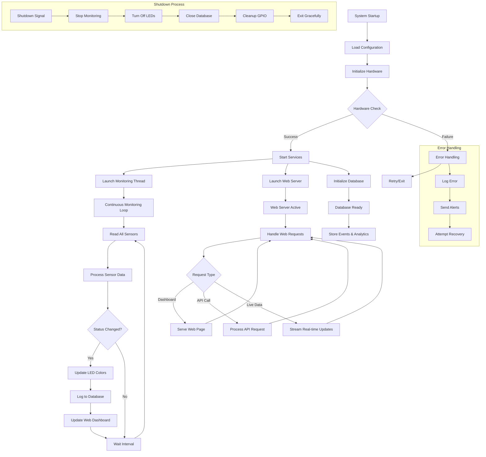
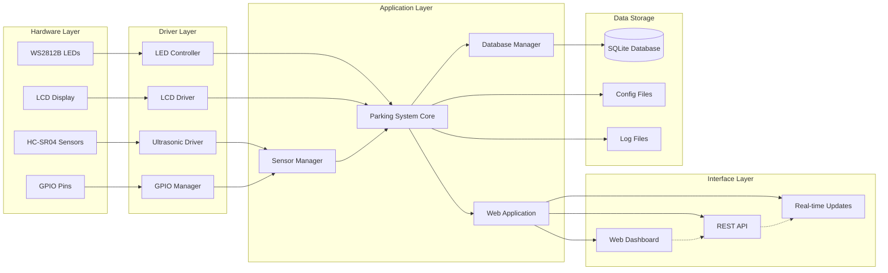
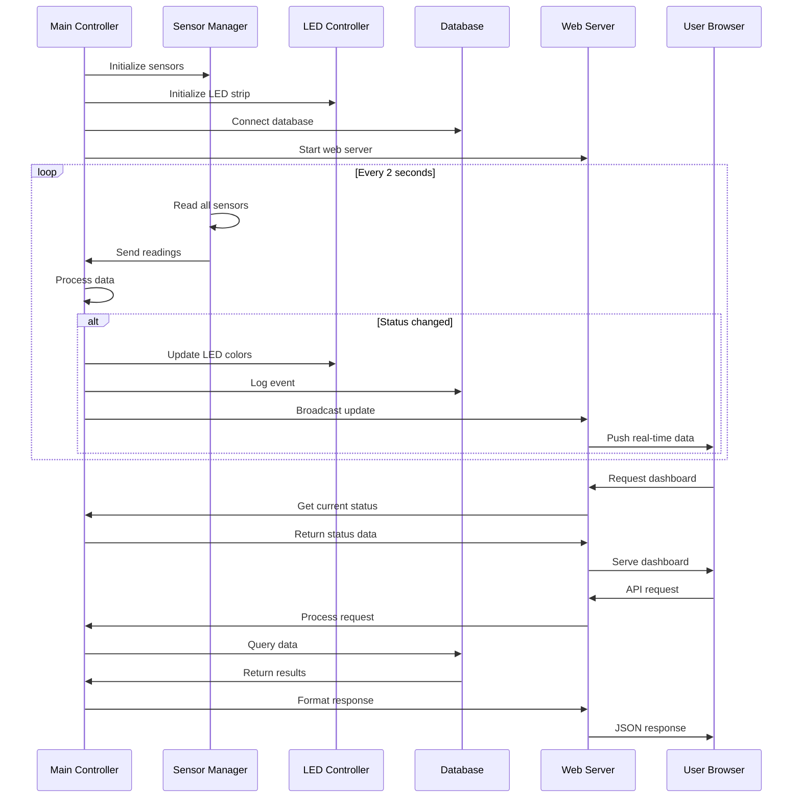
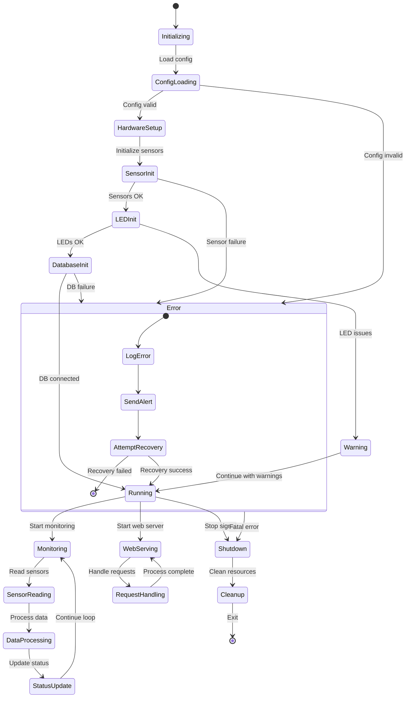

# ParkingPixie -  A Smart Parking Slot Indicator System
_Your parking garage, but smarter._

[🐒 Try Sample Prototype](https://sayang365.github.io/ParkingPixie/index.html)

A Raspberry Pi-powered system that automatically detects when parking spaces are occupied or available, showing the status with colored LED lights and providing a web dashboard for monitoring.

## What Does This System Do?

Imagine walking into a parking garage and instantly knowing which spots are free without driving around looking. This system:

- **Watches parking spaces** using sensors mounted above each spot
- **Shows status with lights**: Green = Available, Red = Occupied  
- **Provides a web dashboard** you can check on your phone or computer
- **Tracks usage patterns** to help understand parking trends
- **Works automatically** 24/7 without human intervention

## How the System Works (Architecture Overview)

Think of this system like a smart home setup with different components working together:

### The "Brain" (Raspberry Pi)
The Raspberry Pi is like the central control unit that:
- Runs the main software
- Coordinates all the other components
- Hosts the web dashboard
- Stores all the parking data

### The "Eyes" (Ultrasonic Sensors) 
- **What they do**: Measure distance to detect if a car is present
- **How they work**: Send out sound waves (like a bat's echolocation) and measure how long it takes to bounce back
- **Positioning**: Mounted 2-3 meters above each parking spot, pointing straight down
- **Smart detection**: If distance is less than 30cm (configurable), a car is detected

### The "Indicators" (LED Lights)
- **Purpose**: Provide instant visual feedback to drivers
- **Colors**:
  - 🟢 **Green** = Parking spot available
  - 🔴 **Red** = Parking spot occupied  
  - 🔵 **Blue** = Reserved spot
  - 🟠 **Orange** = Maintenance needed
- **Placement**: At the entrance of each parking spot where drivers can easily see

### The "Memory" (Database)
- **Function**: Stores all parking events and history
- **Data tracked**: When spots become occupied/free, usage patterns, sensor readings
- **Benefits**: Enables analytics and reporting on parking usage

### The "Interface" (Web Dashboard)
- **Access**: Any device with a web browser (phone, tablet, computer)
- **Features**:
  - Real-time status of all parking spots
  - Historical usage charts
  - System health monitoring
  - Configuration options

## How the Software Components Work Together

The system has several software modules that work like a well-organized team:

### 1. **Main Controller** (`main.py`)
- **Role**: The supervisor that starts and manages everything
- **Function**: Like a conductor of an orchestra, ensures all parts work in harmony
- **Responsibilities**:
  - Starts the sensor monitoring
  - Launches the web server
  - Coordinates between all components
  - Handles system shutdown gracefully

### 2. **Sensor Manager** (`sensor_manager.py`)
- **Role**: Communicates with all the ultrasonic sensors
- **Function**: Like having multiple assistants checking each parking spot
- **Process**:
  1. Sends signals to all sensors simultaneously
  2. Receives distance measurements
  3. Determines if spots are occupied or free
  4. Passes information to other components

### 3. **LED Controller** (`led_controller.py`)
- **Role**: Manages all the colored lights
- **Function**: Like a lighting technician controlling stage lights
- **Capabilities**:
  - Changes colors based on parking status
  - Creates animations and effects
  - Adjusts brightness levels
  - Handles emergency signaling

### 4. **Web Application** (`app.py` & `api.py`)
- **Role**: Provides the user interface and external connections
- **Function**: Like a receptionist providing information to visitors
- **Services**:
  - Serves the web dashboard
  - Handles API requests from other systems
  - Streams real-time updates
  - Manages user interactions

### 5. **Database Manager**
- **Role**: Stores and retrieves all data
- **Function**: Like a librarian organizing and providing information
- **Operations**:
  - Records every parking event
  - Generates usage statistics
  - Maintains historical records
  - Supports data analysis

## How Code Execution Flows

Here's the step-by-step process of how the system operates:

### Technical Flow Diagram



### Data Flow Architecture



### Component Interaction Flow



### System State Machine



### System Startup Sequence
1. **Initialization**: System reads configuration file to understand setup
2. **Hardware Setup**: Connects to sensors and LED strips
3. **Database Connection**: Opens database for data storage
4. **Service Launch**: Starts web server and monitoring processes
5. **Status Display**: Shows startup sequence on LEDs

### Continuous Operation Loop
1. **Sensor Reading** (Every 2 seconds):
   - All sensors take distance measurements simultaneously
   - Raw sensor data is processed and filtered
   - Occupancy status is determined for each spot

2. **Status Update**:
   - Compare new readings with previous status
   - Update LED colors if status changed
   - Log changes to database
   - Broadcast updates to web dashboard

3. **Web Dashboard Refresh**:
   - Browser receives real-time updates
   - Dashboard shows current status
   - Charts and analytics are updated

4. **Data Processing**:
   - Store sensor readings in database
   - Calculate usage statistics
   - Monitor system health
   - Generate alerts if needed

### When Someone Parks/Leaves
```
Car arrives → Sensor detects shorter distance → Status changes to "Occupied" 
→ LED turns RED → Database logs event → Dashboard updates → Process repeats

Car leaves → Sensor detects longer distance → Status changes to "Available" 
→ LED turns GREEN → Database logs event → Dashboard updates → Process repeats
```

## Implementation Guide (No Coding Required)

### Step 1: Get Your Hardware
**Essential Components**:
- Raspberry Pi 4 (with SD card, power supply)
- HC-SR04 Ultrasonic Sensors (1 per parking spot you want to monitor)
- WS2812B LED Strip or individual RGB LEDs
- Jumper wires and breadboard
- Resistors (220Ω and 1kΩ)
- Weatherproof enclosures (for outdoor installation)

**Optional Components**:
- 16x2 LCD Display for local status
- WiFi dongle (if not using Raspberry Pi 4)
- External hard drive for additional storage

### Step 2: Physical Installation

**Sensor Mounting**:
- Mount sensors 2-3 meters above each parking spot
- Point sensors straight down at the center of the parking space
- Ensure sensors are weatherproofed if outdoors
- Run wires back to your Raspberry Pi location

**LED Installation**:
- Place LEDs at the entrance of each parking spot
- Mount at driver eye-level for easy visibility
- Use weatherproof connections
- Consider using diffusers for better light distribution

**Central Unit Setup**:
- Place Raspberry Pi in a secure, weatherproof location
- Ensure good WiFi/Ethernet connectivity
- Provide reliable power supply
- Consider UPS backup for continuous operation

### Step 3: Software Installation (Automated)

**Download and Install**:
```bash
# On your Raspberry Pi terminal:
git clone https://github.com/yourusername/smart-parking-system.git
cd smart-parking-system
sudo chmod +x scripts/install.sh
sudo ./scripts/install.sh
```

**What the installer does**:
- Updates your Raspberry Pi system
- Installs all required software libraries
- Sets up the database
- Configures system services
- Creates management commands
- Sets up the web server

### Step 4: Configuration (Simple Text Editing)

**Edit the configuration file**:
```bash
sudo nano config/config.yaml
```

**Key settings to customize**:
- Number of parking spots
- Distance threshold for detection
- GPIO pin assignments
- LED brightness and colors
- Web server port
- WiFi network settings

### Step 5: Hardware Connection

**Follow the wiring guide**:
- Connect sensors to specified GPIO pins
- Connect LED strip to designated pin
- Double-check all connections
- Test each connection individually

### Step 6: System Testing

**Run built-in tests**:
```bash
parking-system test    # Test all hardware
parking-system start   # Start the system
parking-system status  # Check if running
```

**What tests check**:
- Sensor connectivity and readings
- LED functionality and colors
- Database operations
- Web server accessibility
- Network connectivity

### Step 7: Access and Monitor

**Web Dashboard**:
- Open browser and go to: `http://your-pi-ip-address:8080`
- View real-time status of all parking spots
- Check system health and sensor readings
- View usage analytics and trends

**Mobile Access**:
- Same web address works on phones and tablets
- Responsive design adapts to screen size
- Can be bookmarked for quick access

## 🔧 System Management (Easy Commands)

Once installed, manage your system with simple commands:

```bash
parking-system start     # Start the system
parking-system stop      # Stop the system  
parking-system restart   # Restart the system
parking-system status    # Check if running
parking-system logs      # View system logs
parking-system test      # Test hardware
parking-system backup    # Create data backup
```

## Understanding the Data

### Real-time Dashboard
- **Slot Status**: Visual grid showing all parking spots
- **Occupancy Rate**: Percentage of spots currently occupied
- **Availability Count**: Number of free spots available
- **Last Update**: When data was last refreshed

### Analytics Page
- **Hourly Usage**: Shows busy and quiet times
- **Daily Patterns**: Identifies peak usage days
- **Duration Analysis**: How long cars typically stay
- **Trend Analysis**: Usage patterns over time

### System Monitoring
- **Sensor Health**: Which sensors are working properly
- **Error Rates**: How often sensors fail to get readings
- **System Performance**: CPU, memory, and storage usage
- **Network Status**: Connectivity and response times

## Troubleshooting Common Issues

### Sensors Not Reading
**Symptoms**: LED stays gray, no distance readings
**Solutions**:
- Check sensor wiring connections
- Verify power supply is adequate
- Test individual sensors using test mode
- Check for physical obstructions

### LEDs Not Lighting
**Symptoms**: No LED response, all lights off
**Solutions**:
- Verify LED power supply
- Check data wire connection
- Test LED strip separately
- Check GPIO pin configuration

### Web Dashboard Not Accessible
**Symptoms**: Cannot load web page
**Solutions**:
- Check if system service is running
- Verify network connectivity
- Check firewall settings
- Restart the web service

### Inaccurate Detection
**Symptoms**: Wrong occupancy status shown
**Solutions**:
- Adjust distance threshold settings
- Recalibrate sensors
- Check sensor mounting angle
- Clean sensor surfaces

## Advanced Features You Can Enable

### Email Notifications
- Get alerts when system goes offline
- Daily usage reports
- Maintenance reminders

### Integration with Other Systems
- Connect to building management systems
- Link with payment processing
- Interface with mobile apps

### Machine Learning Enhancement
- Predict busy times
- Optimize pricing based on demand
- Detect unusual patterns

### Multi-location Management
- Monitor multiple parking areas
- Centralized dashboard for all locations
- Comparative analytics across sites

## Learning Resources

### Understanding the Technology
- **Ultrasonic Sensors**: How sound waves measure distance
- **Raspberry Pi GPIO**: Connecting external hardware
- **LED Control**: Digital lighting systems
- **Web Technologies**: How browsers communicate with servers

### Expanding Your Knowledge
- Python programming for custom features
- Electronics basics for hardware modifications
- Network administration for remote access
- Database management for advanced analytics

## Real-World Applications

### Shopping Centers
- Guide customers to available spots
- Reduce traffic congestion
- Improve customer satisfaction
- Generate usage analytics for planning

### Office Buildings
- Optimize employee parking allocation
- Monitor visitor parking usage
- Integrate with security systems
- Support electric vehicle charging stations

### Airports and Transportation Hubs
- Manage large-scale parking operations
- Dynamic pricing based on demand
- Integration with reservation systems
- Real-time availability for travelers

### Smart Cities
- Reduce urban traffic congestion
- Optimize parking enforcement
- Support environmental initiatives
- Improve urban planning decisions

## Community and Support

### Getting Help
- GitHub Issues for bug reports
- Community forums for questions
- Documentation wiki for guides
- Video tutorials for visual learners

### Contributing Improvements
- Report bugs and suggest features
- Share your installation experiences
- Contribute to documentation
- Help other users in forums

This system transforms traditional parking into a smart, efficient solution that benefits both facility owners and users. The automated setup and management make it accessible to anyone, regardless of technical background, while the modular design allows for customization and expansion as needs grow.
